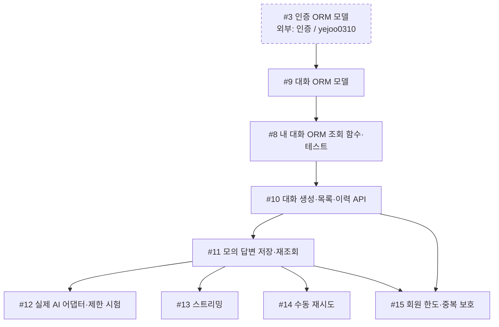

# 채팅·데이터·AI 공정

담당: **`davekim-dev`** · [전체 공정과 직접 선행·후속 표](development-flow.md)

첫 공동 목표는 **로그인 → 모의 완성 답변 → 저장 → 새로고침 뒤 이력 재조회 → #19 연동**이다. 이 그림은 담당 작업에 들어오는 직접 선행 조건을 보여 준다. 한 작업으로 들어오는 **모든 화살표가 필수**이며, 점선 상자는 다른 담당자의 작업이다. 이슈 상태와 PR 병합 여부는 GitHub에서 확인한다.

## 작업 흐름

## 내 이슈

| 이슈 | 작업 |
| --- | --- |
| [#9](https://github.com/next-stop-siren/Next-Stop-Siren/issues/9) | 대화 ORM 모델 |
| [#8](https://github.com/next-stop-siren/Next-Stop-Siren/issues/8) | 내 대화 ORM 조회 함수·테스트 |
| [#10](https://github.com/next-stop-siren/Next-Stop-Siren/issues/10) | 대화 생성·목록·이력 API |
| [#11](https://github.com/next-stop-siren/Next-Stop-Siren/issues/11) | 모의 답변 저장·재조회 |
| [#12](https://github.com/next-stop-siren/Next-Stop-Siren/issues/12) | 실제 AI 어댑터·제한 시험 |
| [#13](https://github.com/next-stop-siren/Next-Stop-Siren/issues/13) | 스트리밍 |
| [#14](https://github.com/next-stop-siren/Next-Stop-Siren/issues/14) | 수동 재시도 |
| [#15](https://github.com/next-stop-siren/Next-Stop-Siren/issues/15) | 회원 한도·중복 보호 |

## 인계와 참고 문서

- **#3 → #9:** 검증·병합된 인증 ORM 모델을 받아 대화 ORM 모델을 만든다. 인증 기능 전체 완료는 #9의 조건이 아니다.
- **#9 → #8 → #10:** 대화 ORM 모델 뒤 소유권을 포함한 조회 함수와 자동 검사를 만들고, #10의 API에서 함수를 재사용한다. 기존 [PR #25](https://github.com/next-stop-siren/Next-Stop-Siren/pull/25)의 가짜 행·예상 결과와 [PR #26](https://github.com/next-stop-siren/Next-Stop-Siren/pull/26)의 제약 검사 초안은 검토 자료다. 새 결과는 ORM 기준으로 검증한다.
- **#11 → #12·#13·#14·#15·#18:** 모의 완성 답변의 저장·재조회 경로를 먼저 검증하고 결과를 화면 담당에게 인계한다. #15에는 #10도 필요하다.
- **결정 대기:** PM이 #11 전에 질문 길이의 저장 전 기준과 답변 생성·회복 기준을 정한다. #12의 제공자·모델·호출·시험 비용, #13의 스트리밍 규칙, #14의 재시도 상태·이전 질문 처리, #15의 한도·집계 방식은 각 구현 전에 확정해야 한다.

[백엔드 지침](../03-development/backend.md) · [DB 설계](../04-reference/database.md) · [API 형식](../04-reference/api.md)
