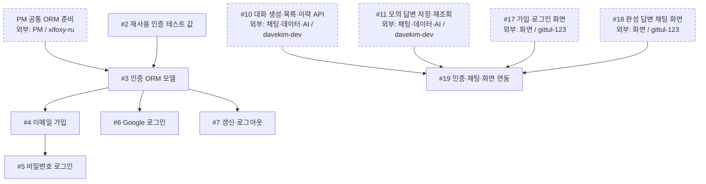

# 인증 공정

담당: **`yejoo0310`** · [전체 공정과 직접 선행·후속 표](development-flow.md)

첫 공동 목표는 **로그인 → 모의 완성 답변 → 저장 → 새로고침 뒤 이력 재조회 → #19 연동**이다. 이 그림은 담당 작업에 들어오는 직접 선행 조건을 보여 준다. 한 작업으로 들어오는 **모든 화살표가 필수**이며, 점선 상자는 다른 담당자의 작업이다. 이슈 상태와 PR 병합 여부는 GitHub에서 확인한다.

## 작업 흐름

## 내 이슈

| 이슈 | 작업 |
| --- | --- |
| [#2](https://github.com/next-stop-siren/Next-Stop-Siren/issues/2) | 재사용 인증 테스트 값 |
| [#3](https://github.com/next-stop-siren/Next-Stop-Siren/issues/3) | 인증 ORM 모델 |
| [#4](https://github.com/next-stop-siren/Next-Stop-Siren/issues/4) | 이메일 가입 |
| [#5](https://github.com/next-stop-siren/Next-Stop-Siren/issues/5) | 비밀번호 로그인 |
| [#6](https://github.com/next-stop-siren/Next-Stop-Siren/issues/6) | Google 로그인 |
| [#7](https://github.com/next-stop-siren/Next-Stop-Siren/issues/7) | 갱신·로그아웃 |
| [#19](https://github.com/next-stop-siren/Next-Stop-Siren/issues/19) | 인증·채팅·화면 연동 |

## 인계와 참고 문서

- **#3 → #9:** PM 공통 ORM 준비와 #2 테스트 값을 받은 뒤 인증 ORM 모델을 검증·병합해 채팅 담당에게 인계한다. 채팅의 #9는 인증 기능 전체 완료를 기다릴 필요가 없다.
- **#5·#6·#7 → #17:** 세 로그인 결과를 화면 담당에게 인계한다. #17은 #16까지 포함한 네 선행 조건을 따른다.
- **#10·#11·#17·#18 → #19:** 네 결과가 모두 준비되면 인증·채팅·화면을 연동한다. 화면 작업을 기다리는 동안 승인된 형식의 연동 검사를 준비할 수 있다.

[인증 기준](authentication.md) · [API 형식](api.md) · [DB 설계](database.md)
