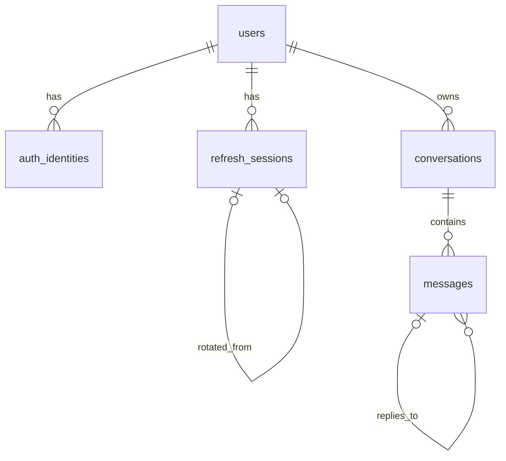

# 데이터베이스 설계

현재 앱에는 아래 테이블과 채팅 기능이 아직 없다. 이 문서는 PostgreSQL 17에서 구현할 **5개 테이블의 설계 기준**이다. [DDL 참고안](database-reference.sql)은 실행된 마이그레이션이 아니며, S02·S08 담당자가 실제 마이그레이션과 테스트를 작성한다.



각 테이블의 기본키 `id`는 `bigint GENERATED ALWAYS AS IDENTITY`이며 FK 컬럼도 `bigint`다. `users.id`가 인증과 채팅의 공통 사용자 ID다. Google과 이메일·비밀번호 계정은 이메일이 같아도 별도 `users` 행이며 자동 연결하지 않는다. Google 로그인 키는 **검증된** `(issuer, subject)`이고 이메일은 식별 키가 아니다.

DB의 `bigint`는 JavaScript 안전 정수 범위를 넘을 수 있다. [공통 API 형식](api.md)은 ID를 JSON 십진 문자열로 전송한다. 화면에서 숫자로 변환하지 않는다.

## 테이블과 컬럼

`필수`는 `NOT NULL`, `NULL`은 비워 둘 수 있음을 뜻한다. `기본값 없음`인 필수 필드는 삽입 시 값을 줘야 한다.

### `users` — 공통 사용자

| 필드 | 타입 | 필수 여부·기본값 | 의미 |
| --- | --- | --- | --- |
| `id` | `bigint` | 필수 · identity | 기본키 |
| `email` | `text` | 필수 · 기본값 없음 | 연락·표시용 이메일 |
| `password_hash` | `text` | NULL · 기본값 없음 | 로컬 계정 해시; Google 전용 계정은 NULL |
| `created_at` | `timestamptz` | 필수 · `now()` | 생성 시각 |

### `auth_identities` — Google 신원

| 필드 | 타입 | 필수 여부·기본값 | 의미 |
| --- | --- | --- | --- |
| `id` | `bigint` | 필수 · identity | 기본키 |
| `user_id` | `bigint` | 필수 · 기본값 없음 | `users.id` FK |
| `provider` | `text` | 필수 · `google` | 현재 허용된 제공자 |
| `issuer` | `text` | 필수 · 기본값 없음 | 검증된 발급자 |
| `subject` | `text` | 필수 · 기본값 없음 | 검증된 제공자 사용자 ID |
| `created_at` | `timestamptz` | 필수 · `now()` | 생성 시각 |

### `refresh_sessions` — refresh 세션

| 필드 | 타입 | 필수 여부·기본값 | 의미 |
| --- | --- | --- | --- |
| `id` | `bigint` | 필수 · identity | 기본키 |
| `user_id` | `bigint` | 필수 · 기본값 없음 | `users.id` FK |
| `token_digest` | `bytea` | 필수 · 기본값 없음 | 32바이트 digest; 원문 토큰 저장 금지 |
| `rotated_from_id` | `bigint` | NULL · 기본값 없음 | 같은 사용자의 전임 세션 FK |
| `issued_at` | `timestamptz` | 필수 · `now()` | 발급 시각 |
| `expires_at` | `timestamptz` | 필수 · 기본값 없음 | 만료 시각 |
| `revoked_at` | `timestamptz` | NULL · 기본값 없음 | 폐기 시각 |

### `conversations` — 대화 소유권

| 필드 | 타입 | 필수 여부·기본값 | 의미 |
| --- | --- | --- | --- |
| `id` | `bigint` | 필수 · identity | 기본키 |
| `user_id` | `bigint` | 필수 · 기본값 없음 | 소유자 `users.id` FK |
| `created_at` | `timestamptz` | 필수 · `now()` | 생성 시각 |
| `updated_at` | `timestamptz` | 필수 · `now()` | 최근 변경 시각; 서비스가 갱신 |

### `messages` — 질문과 답변 시도

| 필드 | 타입 | 필수 여부·기본값 | 의미 |
| --- | --- | --- | --- |
| `id` | `bigint` | 필수 · identity | 기본키·표시 순서 |
| `conversation_id` | `bigint` | 필수 · 기본값 없음 | `conversations.id` FK |
| `role` | `text` | 필수 · 기본값 없음 | `user` 질문 또는 `assistant` 답변 |
| `status` | `text` | 필수 · 기본값 없음 | `pending`, `completed`, `failed`, `interrupted` |
| `content` | `text` | NULL · 기본값 없음 | 완료 본문; 대기·실패·중단 답변은 NULL |
| `request_key` | `text` | NULL · 기본값 없음 | 질문 재전송 식별 키 |
| `reply_to_message_id` | `bigint` | NULL · 기본값 없음 | 답변이 참조하는 같은 대화의 질문 FK |
| `attempt_no` | `integer` | NULL · 기본값 없음 | 답변 시도 번호 |
| `retry_key` | `text` | NULL · 기본값 없음 | 재시도 식별 키 |
| `error_code` | `text` | NULL · 기본값 없음 | 실패·중단 이유 코드 |
| `created_at` | `timestamptz` | 필수 · `now()` | 생성 시각 |
| `updated_at` | `timestamptz` | 필수 · `now()` | 최근 변경 시각; 서비스가 갱신 |
| `completed_at` | `timestamptz` | NULL · 기본값 없음 | 질문·완료 답변의 완료 시각 |

모든 FK는 `ON DELETE RESTRICT`다. **초기 범위에 계정·대화 삭제 기능은 없다.** FK는 참조하는 자식 행이 있을 때 부모 행의 삭제를 막는다. 보존 기간, 일괄 삭제, 백업·운영 로그 처리는 별도 결정이다.

## 제약과 조회 경로

- `auth_identities(issuer, subject)`는 Google 신원 중복을 막는다. `users`의 로컬 이메일 부분 유일 인덱스는 `password_hash IS NOT NULL`에만 적용한다. 서비스는 계정 종류와 신원 일치, 이메일 입력을 확인한다.
- `refresh_sessions.token_digest`는 유일하고 32바이트다. 전임 ID의 유일성은 후임을 하나로 제한하며 `(rotated_from_id, user_id) → (id, user_id)`는 같은 사용자 연결을 강제한다. `(user_id, expires_at DESC)`는 사용자 세션 조회용이다.
- `conversations(user_id, updated_at DESC, id DESC)`는 내 대화 목록용이다. `messages(conversation_id, id)`는 대화 안의 표시 순서용이다.
- `messages`의 부분 유일 인덱스는 대화의 `request_key`, 질문별 `attempt_no`·`retry_key`, 대화별 활성 `pending` 답변의 중복을 막는다. `messages(reply_to_message_id, attempt_no DESC)`는 답변 이력 조회용이다.
- `reply_to_message_id` 복합 FK는 같은 대화의 메시지만 참조하게 한다. 참조 대상이 실제 `user` 질문인지, 모든 읽기·쓰기 요청자가 대화 소유자인지는 서비스가 확인한다.

digest 산출법, 토큰 수명·회전·재사용 대응, 쿠키·CSRF·로그아웃 정책은 D1에서 정한다. DDL만으로 이 동작이 구현되지는 않는다.

## 저장과 소유권

가짜 예시: 사용자 `101`(`a@example.test`, 로컬)과 `202`(`a@example.test`, Google `(https://accounts.google.com, g-202)`)는 다른 행이다. 사용자 `101`의 대화 `501`에는 질문 `9001`(`request_key=q-demo-1`, `안녕?`)과 완료 답변 `9002`(`reply_to_message_id=9001`, `attempt_no=1`, `안녕하세요.`)가 있다. 사용자 `202`가 대화 `501`을 조회하거나 쓰면 서버는 찾을 수 없음으로 응답한다.

```sql
-- $1: 인증 미들웨어가 검증한 사용자 ID, $2: 요청한 대화 ID
SELECT m.id, m.role, m.status, m.content, m.created_at
FROM conversations AS c
JOIN messages AS m ON m.conversation_id = c.id
WHERE c.id = $2 AND c.user_id = $1
ORDER BY m.id;
```

1. 인증 미들웨어가 검증한 principal의 `user_id`로 `conversations.id`와 소유자를 함께 조회한다. 모든 대화 읽기·쓰기에 이 조건을 적용한다. `messages` FK만으로 사용자 격리를 보장하지 않는다.
2. 공백만인 질문은 거부한다. 질문과 첫 `pending` 답변을 짧은 트랜잭션에서 생성한다. 같은 요청 키의 다른 본문은 충돌로 처리하고, 동일 재전송은 기존 결과를 조회한다.
3. 완료된 답변만 다음 AI 문맥에 넣는다. 실패·중단 답변의 `content`는 NULL이다. 상태 전이와 `updated_at` 갱신은 서비스가 담당한다.

첫 내부 목표는 모의 제공자의 완성 답변 저장·재조회다. 수동 재시도·스트리밍의 상세 규칙, 생성/회복 기한과 회원 한도는 후속 단계에서 정한다.

## 소유자와 적용 순서

1. 백엔드 B는 S07에서 가짜 사용자 둘의 조회 예시를 먼저 만들 수 있다. 통합 전에는 합의한 `bigint` 사용자 ID를 주입한 신뢰 fixture로 검증한다.
2. 백엔드 A는 S02에서 `users → auth_identities → refresh_sessions` 마이그레이션과 인증을 맡는다.
3. S02 적용 후 백엔드 B가 S08에서 `conversations → messages` 마이그레이션과 채팅을 맡는다. 깨끗한 테스트 DB 적용은 **S02 → S08**, 되돌림은 **S08 → S02** 순서다.
4. 실제 JWT/Google 보호와 사용자 간 격리는 A/B 통합 때 확인한다.

최소 인수 확인:

- [ ] 깨끗한 테스트 DB에서 S02·S08 적용과 역순 되돌림이 성공한다.
- [ ] 잘못된 FK와 중복 `request_key`·답변 시도·`retry_key`가 거부된다.
- [ ] 같은 이메일의 로컬·Google 계정이 분리되고 Google은 검증된 `(issuer, subject)`로 식별된다.
- [ ] 타인 대화의 읽기·쓰기가 거부된다.
- [ ] 완료 답변만 재조회·문맥에 포함되고 실패·중단 답변은 문맥에서 빠진다.

D1 인증 보안값과 D4 재시도/회복값이 결정된 뒤 그 동작을 별도로 시험한다. 이 문서 작업에서는 **SQL을 실행하지 않았다**.
