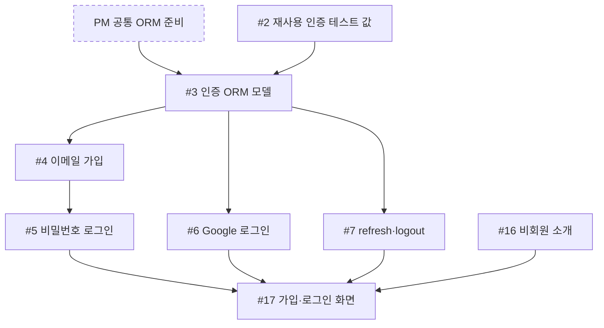
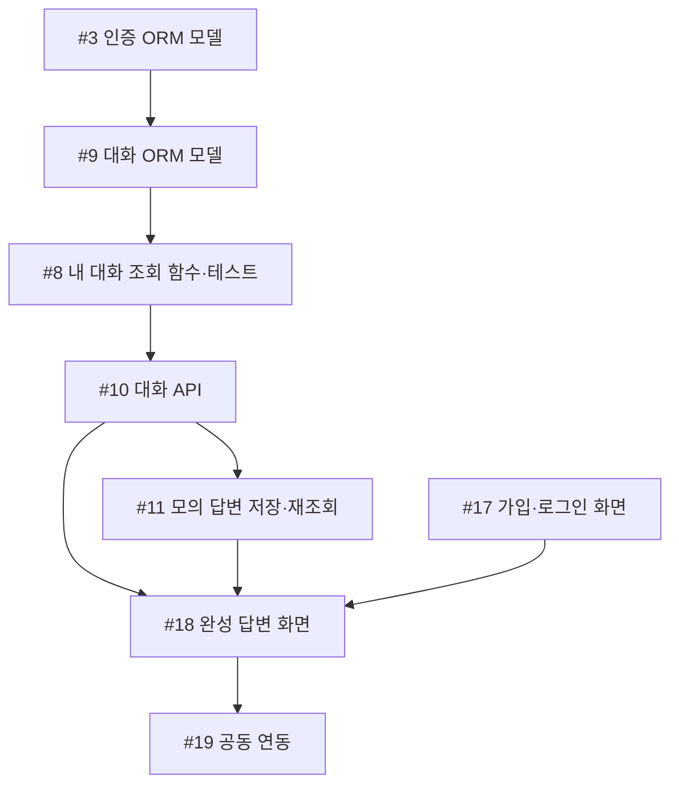

# 공정진행도

이 문서는 팀의 **작업 순서와 인계 지점**을 보여 준다. 진행률이나 완료 현황을 기록하는 문서는 아니다. 각 이슈의 실제 상태·막힌 이유는 연결된 이슈에서, 검토·병합 여부는 해당 PR에서 확인한다. 이슈가 열려 있다는 사실만으로 미착수를 뜻하지 않는다. 아래 표의 선행 작업은 **검증을 마치고 병합되어 다음 작업에서 사용할 수 있는 결과**를 뜻한다.

현재 팀 작업의 `S01`–`S20`은 이슈 #2–#21에 각각 대응하는 고정 식별자다(`#2 = S01`, `#21 = S20`). 번호는 작업 순서나 현재 진행 상태를 뜻하지 않는다. 실제 시작 순서는 아래 직접 선행 조건으로 확인한다.

처음에는 인증 [#2](https://github.com/next-stop-siren/Next-Stop-Siren/issues/2)와 화면 [#16](https://github.com/next-stop-siren/Next-Stop-Siren/issues/16)을 진행할 수 있다. 채팅은 PM의 [공통 ORM 준비](stack.md#개발과-초기-db)와 #3 인증 모델 뒤 #9 대화 모델을 만들고, 그 뒤 #8 조회 함수를 시작한다. 표의 `—`는 선행 칸에서는 로컬 준비 뒤 시작 가능, 다음 칸에서는 **이 표에 있는 직접 후속 이슈가 없음**을 뜻한다. 프로젝트 전체의 완료를 뜻하지 않는다.

## 담당별 경로

| 담당 | 담당 문서 | 맡은 이슈 |
| --- | --- | --- |
| 인증 `yejoo0310` | [인증 공정](auth-flow.md) | #2–#7, #19 공동 연동 |
| 채팅·데이터·AI `davekim-dev` | [채팅·데이터·AI 공정](chat-flow.md) | #8–#15 |
| 화면 `gittul-123` | [화면 공정](frontend-flow.md) | #16–#18, #20–#21 |

담당 문서의 그림은 각자의 작업과 필요한 외부 인계를 보여 준다. **모든 직접 선행 조건은 아래 표가 기준**이다. PM `xifoxy-ru`는 정책 값을 확정하고 공통 형식·선행 이슈 PR을 검토하며, 시작 조건이 바뀌면 해당 이슈를 갱신한다.

**공동 목표**

로그인 → 모의 완성 답변 → 저장 → 새로고침 뒤 재조회 → [#19 인증·채팅·화면 연동](https://github.com/next-stop-siren/Next-Stop-Siren/issues/19)

이후 실제 AI·회원 한도·스트리밍·재시도를 다룬다. 아래 그림은 주요 인계만 요약하며, **모든 직접 선행 조건은 표가 기준**이다.

## 이슈별 직접 선행·후속 작업

| 담당 | 이슈·결과 | 직접 선행 | 직접 후속 |
| --- | --- | --- | --- |
| 인증 | [#2 재사용 인증 테스트 값](https://github.com/next-stop-siren/Next-Stop-Siren/issues/2) | — | #3 |
| 인증 | [#3 인증 ORM 모델](https://github.com/next-stop-siren/Next-Stop-Siren/issues/3) | #2 + [PM 공통 ORM 준비](stack.md#개발과-초기-db) | #4, #6, #7, #9 |
| 인증 | [#4 이메일 가입](https://github.com/next-stop-siren/Next-Stop-Siren/issues/4) | #3 | #5 |
| 인증 | [#5 비밀번호 로그인](https://github.com/next-stop-siren/Next-Stop-Siren/issues/5) | #4 | #17 |
| 인증 | [#6 Google 로그인](https://github.com/next-stop-siren/Next-Stop-Siren/issues/6) | #3 | #17 |
| 인증 | [#7 refresh·logout](https://github.com/next-stop-siren/Next-Stop-Siren/issues/7) | #3 | #17 |
| 인증·공동 연동 | [#19 인증·채팅·화면 연동](https://github.com/next-stop-siren/Next-Stop-Siren/issues/19) | #10, #11, #17, #18 | — |
| 채팅 | [#9 대화 ORM 모델](https://github.com/next-stop-siren/Next-Stop-Siren/issues/9) | #3 | #8 |
| 채팅 | [#8 내 대화 ORM 조회 함수·테스트](https://github.com/next-stop-siren/Next-Stop-Siren/issues/8) | #9 | #10 |
| 채팅 | [#10 대화 생성·목록·이력 API](https://github.com/next-stop-siren/Next-Stop-Siren/issues/10) | #8 | #11, #15, #18, #19 |
| 채팅 | [#11 모의 완성 답변 저장·재조회](https://github.com/next-stop-siren/Next-Stop-Siren/issues/11) | #10 | #12, #13, #14, #15, #18, #19 |
| 채팅 | [#12 실제 AI 어댑터·제한 시험](https://github.com/next-stop-siren/Next-Stop-Siren/issues/12) | #11 | — |
| 채팅 | [#13 스트리밍](https://github.com/next-stop-siren/Next-Stop-Siren/issues/13) | #11 | #20 |
| 채팅 | [#14 수동 재시도](https://github.com/next-stop-siren/Next-Stop-Siren/issues/14) | #11 | #21 |
| 채팅 | [#15 회원 한도·중복 보호](https://github.com/next-stop-siren/Next-Stop-Siren/issues/15) | #10, #11 | — |
| 화면 | [#16 비회원 소개](https://github.com/next-stop-siren/Next-Stop-Siren/issues/16) | — | #17 |
| 화면 | [#17 가입·로그인 화면](https://github.com/next-stop-siren/Next-Stop-Siren/issues/17) | #5, #6, #7, #16 | #18, #19 |
| 화면 | [#18 완성 답변 채팅 화면](https://github.com/next-stop-siren/Next-Stop-Siren/issues/18) | #10, #11, #17 | #19, #20, #21 |
| 화면 | [#20 스트리밍 화면](https://github.com/next-stop-siren/Next-Stop-Siren/issues/20) | #13, #18 | — |
| 화면 | [#21 재시도 화면](https://github.com/next-stop-siren/Next-Stop-Siren/issues/21) | #14, #18 | — |

## 막히기 쉬운 인계

- **PM 공통 ORM 준비 → #3 → #9 → #8 → #10:** PM은 공통 엔진·세션·모델 등록과 보호된 테스트 DB 초기화를 제공한다. #3 인증 모델, #9 대화 모델을 검증·병합한 뒤 #8의 소유권 조회 함수와 자동 검사를 작성한다. #10은 이 함수를 재사용한다. 인증 기능 전체 완료는 #9의 조건이 아니다.
- **#5·#6·#7 → #17:** 화면 담당은 기다리는 동안 승인된 [API·인증 형식](api.md#인증-요청응답--후속-구현-기준)을 읽고 화면 상태, 가짜 응답 예시, 검사 시나리오를 준비할 수 있다. #17 구현 시작·실제 API 연동·완료에는 기존 네 선행 조건(#5·#6·#7·#16)을 그대로 적용한다.
- **#11 → #12~#15·#18:** 채팅 담당은 모의 완성 답변의 저장·재조회 경로를 먼저 검증한다. PM은 #11 전에 질문 길이의 **저장 전 기준**, 답변 생성 기한과 멈춘 답변의 회복 기준을 정한다. #12의 제공자·모델·호출 및 시험 비용, #13/#20의 스트리밍 규칙, #14/#21의 재시도 허용 상태·이전 질문 처리, #15의 한도·집계 방식도 각각 구현 전에 정해야 한다.
- **#17·#18 → #19:** 화면 작업이 늦어지면 인증·채팅 담당은 이미 승인된 형식의 연동 검사와 선행 조건이 충족된 독립 후속 작업을 준비한다. PM은 다른 작업을 막는 이슈와 PR 검토를 우선한다.
- **#13 → #20, #14 → #21:** 서버 결과와 화면 동작을 각각 인계해 함께 확인한다. 실제 AI를 사용자에게 열려면 #12의 제한 시험 외에도 #15와 #19의 결과 및 배포 검증이 필요하다.

일정이나 소요 시간이 정해지지 않았으므로 이 문서는 완료 날짜나 예상 최장 경로를 제시하지 않는다. 최신 착수·차단·검토·완료 판단은 [GitHub 이슈 목록](https://github.com/next-stop-siren/Next-Stop-Siren/issues)에서 해당 이슈와 연결 PR을 확인한다.
