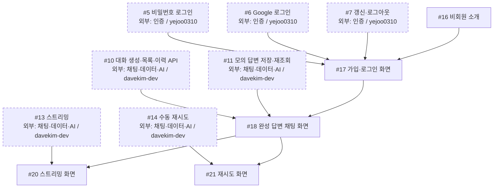

# 화면 공정

담당: **`gittul-123`** · [전체 공정과 직접 선행·후속 표](development-flow.md)

첫 공동 목표는 **로그인 → 모의 완성 답변 → 저장 → 새로고침 뒤 이력 재조회 → #19 연동**이다. 이 그림은 담당 작업에 들어오는 직접 선행 조건을 보여 준다. 한 작업으로 들어오는 **모든 화살표가 필수**이며, 점선 상자는 다른 담당자의 작업이다. 이슈 상태와 PR 병합 여부는 GitHub에서 확인한다.

## 작업 흐름

## 내 이슈

| 이슈 | 작업 |
| --- | --- |
| [#16](https://github.com/next-stop-siren/Next-Stop-Siren/issues/16) | 비회원 소개 |
| [#17](https://github.com/next-stop-siren/Next-Stop-Siren/issues/17) | 가입·로그인 화면 |
| [#18](https://github.com/next-stop-siren/Next-Stop-Siren/issues/18) | 완성 답변 채팅 화면 |
| [#20](https://github.com/next-stop-siren/Next-Stop-Siren/issues/20) | 스트리밍 화면 |
| [#21](https://github.com/next-stop-siren/Next-Stop-Siren/issues/21) | 재시도 화면 |

## 인계와 참고 문서

- **#5·#6·#7·#16 → #17:** 기다리는 동안 승인된 API·인증 형식으로 화면 상태, 가짜 응답 예시, 검사 시나리오를 준비할 수 있다. #17 구현 시작·실제 API 연동·완료에는 네 선행 조건을 모두 적용한다.
- **#10·#11·#17 → #18:** 대화 API와 모의 답변 저장·재조회 결과를 받아 완성 답변 화면에 연결한다. #17·#18 결과는 #19 공동 연동에 인계한다.
- **#13·#18 → #20, #14·#18 → #21:** 서버의 스트리밍·재시도 결과와 화면 동작을 함께 확인한다. 관련 규칙은 PM 결정 후 구현한다.

[화면 지침](frontend.md) · [API 형식](api.md) · [인증 기준](authentication.md)
